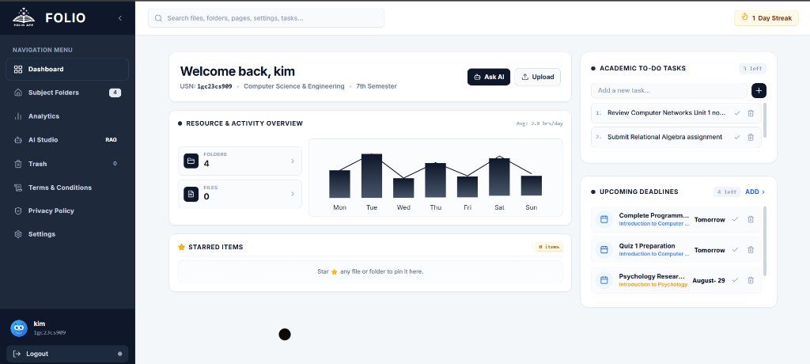
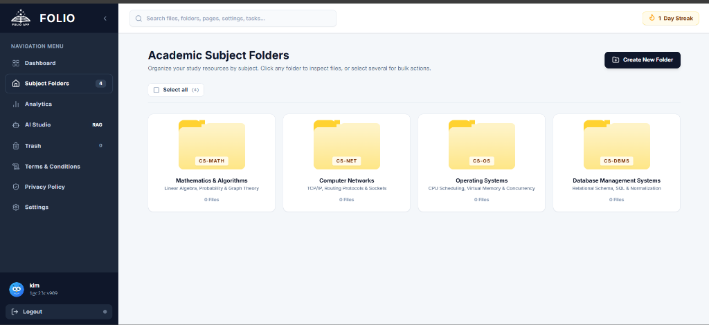
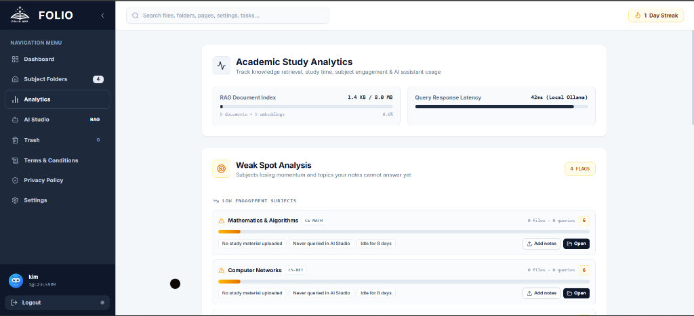
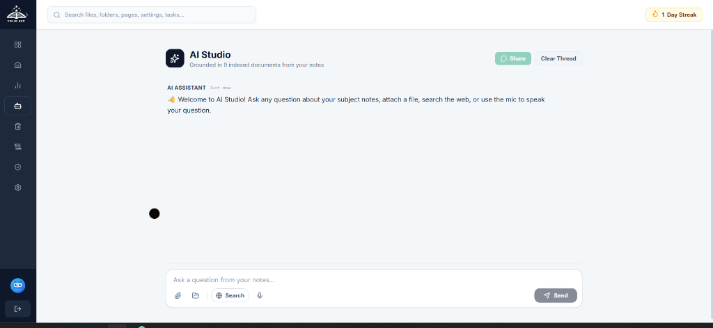
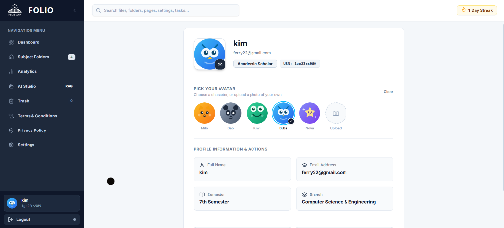
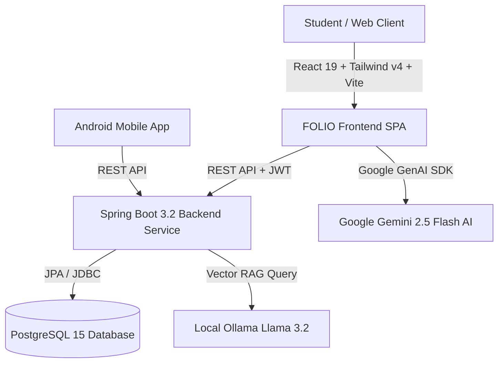

# FOLIO - Smart Student Study Studio & Academic Resource Management System

<div align="center">


[](https://react.dev/)
[](https://www.typescriptlang.org/)
[](https://vitejs.dev/)
[](https://tailwindcss.com/)
[](https://spring.io/projects/spring-boot)
[](https://firebase.google.com/)
[](https://ai.google.dev/)

<br/>

---
--

**FOLIO** is an all-in-one, high-performance academic resource management platform and AI study studio engineered for students. Featuring an ultra-clean Slate-Gray design system, interactive 3D subject folders, visx animated activity charts, AI study intelligence (Google Gemini 2.5 & Local Ollama RAG), document recovery trash bin, and Firebase (Cloud Firestore & Storage) persistence.

</div>
---

## 🖼️ Application Interface Preview

| 📊 Dashboard & Viewport Overview | 📁 Academic Subject Folders |
| :---: | :---: |
|  |  |

| 📈 Academic & AI Study Analytics | 🤖 Full-Page AI Studio (RAG) |
| :---: | :---: |
|  |  |

| 👤 Student Profile & Avatar Customization |
| :---: |
|  |

---

## 📑 Table of Contents

- [Key Features](#-key-features)
  - [1. Dashboard & Slate-Gray Design System](#1-dashboard--slate-gray-design-system)
  - [2. Interactive 3D Subject Folders & Starred Items](#2-interactive-3d-subject-folders--starred-items)
  - [3. Visx Animated Activity Bar Chart](#3-visx-animated-activity-bar-chart)
  - [4. Academic & AI Study Analytics](#4-academic--ai-study-analytics)
  - [5. Full-Page AI Studio with Gemini & Ollama RAG](#5-full-page-ai-studio-with-gemini--ollama-rag)
  - [6. Trash Bin & Soft-Delete File Recovery](#6-trash-bin--soft-delete-file-recovery)
  - [7. In-App Document Reader & Device Exports](#7-in-app-document-reader--device-exports)
  - [8. Universal Themed Modals & Notification Dialogs](#8-universal-themed-modals--notification-dialogs)
  - [9. PostgreSQL 15 & Spring Boot Backend](#9-postgresql-15--spring-boot-backend)
  - [10. Native Android Mobile App](#10-native-android-mobile-app)
- [Architecture & Tech Stack](#-architecture--tech-stack)
- [Project Directory Structure](#-project-directory-structure)
- [Quick Start Guide](#-quick-start-guide)
  - [Prerequisites](#prerequisites)
  - [1. Frontend Setup](#1-frontend-setup)
  - [2. Backend & Database Setup](#2-backend--database-setup)
  - [3. Mobile Application](#3-mobile-application)
- [Environment Configuration](#-environment-configuration)
- [REST API Reference](#-rest-api-reference)
- [Documentation](#-documentation)
- [License](#-license)


## 🌟 Key Features

### 1. Dashboard & Slate-Gray Design System
- **Slate-Gray Visual Language**: Deep slate tones (`#0f172a`, `#1e293b`, `#334155`, `#475569`) with crisp typography and high-contrast accents.
- **Single-Viewport Compact Layout**: Designed specifically to fit standard viewports seamlessly without unnecessary vertical page scrolling.
- **Omni-Search Autocomplete**: Instant search bar with autocomplete suggestions across subjects, notes, deadlines, and settings with visual flash indicators.
- **Study Streak Badge**: Animated streak tracker (`🔥 12 Day Streak`) aligned at the header for daily study motivation.
- **Academic To-Do & Upcoming Deadlines**: Numbered interactive checklist with smooth completion strikethrough animations, date-sorted upcoming deadlines, and calendar modal date picker.

### 2. Interactive 3D Subject Folders & Starred Items
- **Tactile 3D Folder Cards**: Custom 3D CSS perspective folder component ([folder.tsx](frontend/src/components/ui/folder.tsx)) featuring soft pastel amber tones, paper sheet layers, and perspective hover tilt animations.
- **Responsive 4-Column Grid**: Responsive layout for subject organization (`DBMS`, `OS`, `Networks`, `Maths`, `AI/ML`).
- **Favorite Resources (Starred Items)**: Star toggle on folders and documents to pin high-priority study materials directly to the dashboard.

### 3. Visx Animated Activity Bar Chart
- **Visx Powered Visualizations**: High-performance SVG bar charts built using `@visx/scale`, `@visx/grid`, `@visx/gradient`, and `motion/react`.
- **Standing Rectangular Bars**: Smooth vertical linear gradients (`from-slate-900 to-slate-600`), interactive hover tooltips, SVG reference line indicators, and spaced weekday labels (`Mon` - `Sun`).

### 4. Academic & AI Study Analytics
- **Subject Activity Breakdown**: Live engagement percentage graphs for all enrolled subjects.
- **AI Study Studio Metrics**: Quantitative tracking for questions asked, documents summarized, quizzes generated, and flashcards built.
- **Most Explored Topics**: Ranked bar visualizer highlighting top study topics (e.g., *CPU Scheduling*, *Database Normalization*, *TCP/IP Protocols*).
- **Smooth Staggered Width Animations**: Entrance transitions (`transition-all duration-1000 ease-out`) that animate smoothly whenever the Analytics tab is opened.

### 5. Full-Page AI Studio with Gemini & Ollama RAG
- **Clean Full-Page Chat Layout**: Distraction-free conversational interface optimized for reviewing notes, explaining complex algorithms, and generating study summaries.
- **Google Gemini 2.5 Flash Integration**: Powered by `@google/genai` SDK using `VITE_GEMINI_API_KEY` / `GEMINI_API_KEY` for intelligent academic assistance.
- **Prompt Topic Pills**: Quick prompt chips (*"Explain Deadlocks"*, *"Generate Practice Quiz"*, *"Summarize Chapter"*, *"Key Formulas"*) for one-click prompts.
- **Local Ollama AI Fallback**: Offline vector search (RAG) powered by local Llama 3.2 models for privacy-focused document question answering.

### 6. Trash Bin & Soft-Delete File Recovery
- **Safe Soft Deletion**: Deleting documents moves them safely into the dedicated **Trash Bin** (`/trash`) instead of permanent removal.
- **One-Click File Restore**: Restore trashed lecture notes and documents back to their original subject folders instantly.
- **Permanent Removal & Batch Empty Trash**: Ability to permanently delete individual files or clear all trashed files with a single click.
- **Full Backend Trash Sync**: Synced with Spring Boot REST API endpoints (`GET /api/v1/documents/trash`, `PUT /api/v1/documents/{id}/restore`, `DELETE /api/v1/documents/trash/empty`).

### 7. In-App Document Reader & Device Exports
- **Direct In-App Reading**: Instant modal previewer (`View In-App`) for PDFs, text notes, and summaries without forcing downloads.
- **Disk File Export**: Dedicated download handler (`Download`) for saving resources directly to the user's filesystem.

### 8. Universal Themed Modals & Notification Dialogs
- **Zero Browser Alerts**: Replaced default browser `alert()` dialogs with custom-styled modal popups.
- **Context-Aware Visual Badges**: Emerald checkmark for successful file uploads, amber warning badges for delete confirmations, and slate info banners for system notices.

### 9. PostgreSQL 15 & Spring Boot Backend
- **PostgreSQL 15 Persistence**: Production-grade relational database (`foliodb` on port `5432`) with Spring Data JPA.
- **Pre-Configured DDL Schema**: Complete PostgreSQL DDL initialization script ([schema-postgres.sql](backend/src/main/resources/schema-postgres.sql)) defining tables for `users`, `subjects`, `documents`, `document_chunks`, and `personal_notes`.
- **Docker Compose + Adminer Web UI**: Included [docker-compose.yml](docker-compose.yml) running PostgreSQL 15 alongside Adminer Database GUI at `http://localhost:8088/`.
- **H2 Offline Fallback**: Includes `application-h2.properties` for zero-configuration local development.

### 10. Native Android Mobile App
- **Android Client**: Native Android companion application in `mobile/` built with Kotlin, Gradle Kotlin DSL, and modern Jetpack components for managing study resources on the go.

---

## 🛠️ Architecture & Tech Stack



| Layer | Technologies |
| :--- | :--- |
| **Frontend Framework** | [React 19](https://react.dev/), [TypeScript](https://www.typescriptlang.org/), [Vite 8](https://vitejs.dev/) |
| **Styling & Design** | [Tailwind CSS v4](https://tailwindcss.com/), Custom Vanilla CSS Tokens, Lucide React Icons |
| **Data Visualizations** | [@visx/scale](https://airbnb.io/visx/), [@visx/grid](https://airbnb.io/visx/), [@visx/gradient](https://airbnb.io/visx/), [Motion (Framer)](https://motion.dev/) |
| **AI Study Intelligence** | [@google/genai](https://www.npmjs.com/package/@google/genai) (Google Gemini 2.5 Flash), Ollama (Llama 3.2 RAG) |
| **Backend Framework** | [Spring Boot 3.2](https://spring.io/projects/spring-boot), Java 25 / 17, Spring Security, JWT Auth |
| **Document Ingestion** | [Apache Tika](https://tika.apache.org/) (PDF / Word Text Extraction & Chunking) |
| **Database & Persistence**| [PostgreSQL 15](https://www.postgresql.org/), Hibernate JPA, H2 Database (Offline Fallback) |
| **Containerization** | [Docker](https://www.docker.com/), [Docker Compose](https://docs.docker.com/compose/), Adminer Web UI |
| **Mobile Client** | Native Android (Kotlin, Jetpack, Gradle Kotlin DSL) |

---

## 📂 Project Directory Structure

```text
FOLIO/
├── backend/                             # Spring Boot REST API Backend
│   ├── src/main/java/com/folio/
│   │   ├── config/                      # WebSecurity & CORS Configuration
│   │   ├── controller/                  # API Controllers (Auth, Api, Note)
│   │   ├── dto/                         # Request & Response Data Transfer Objects
│   │   ├── model/                       # JPA Entities (User, Subject, Document, Note)
│   │   ├── repository/                  # Spring Data JPA Repositories
│   │   ├── security/                    # JWT Token Utilities & Filters
│   │   └── service/                     # DocumentService & Ollama RAG Integration
│   ├── src/main/resources/
│   │   ├── application.properties       # PostgreSQL 15 configuration
│   │   ├── application-h2.properties    # H2 offline development properties
│   │   └── schema-postgres.sql          # PostgreSQL DDL Table Creation Script
│   └── pom.xml                          # Maven dependencies & build definitions
├── frontend/                            # React 19 + TypeScript + Vite Frontend SPA
│   ├── src/
│   │   ├── components/ui/
│   │   │   ├── bar-chart.tsx            # Visx SVG Activity Bar Chart wrapper
│   │   │   ├── dashboard-sidebar.tsx    # Main Application Shell, Navigation & Views
│   │   │   ├── folder.tsx               # 3D Animated Subject Folder Card
│   │   │   ├── input.tsx                # Custom input primitives
│   │   │   ├── label.tsx                # Label UI primitives
│   │   │   └── search-input.tsx         # Omni-search autocomplete component
│   │   ├── lib/                         # Utility helpers & state management
│   │   ├── main.tsx                     # React application root
│   │   └── style.css                    # Tailwind CSS v4 directives & root theme
│   ├── .env                             # Frontend environment variables
│   ├── package.json                     # Node.js dependencies & scripts
│   └── vite.config.ts                   # Vite 8 configuration with Tailwind plugin
├── mobile/                              # Native Android Companion Mobile Application
│   ├── app/
│   │   ├── src/main/java/com/folio/     # Kotlin application codebase
│   │   ├── AndroidManifest.xml          # Android app manifest
│   │   └── build.gradle.kts             # App-level Gradle build configuration
│   └── build.gradle.kts                 # Root-level Gradle build configuration
├── assets/
│   └── images/                          # Screenshot previews for documentation
├── docker-compose.yml                   # PostgreSQL 15 & Adminer container definitions
├── DESIGN_METHODOLOGY.md                # UI/UX design specifications & palette guide
├── IMPLEMENTATION_GUIDE.md              # Technical architecture & code mapping
└── README.md                            # Main project overview & setup guide
```

---

## 🚀 Quick Start Guide

### Prerequisites
- **Node.js** 18+ and **npm** installed
- **Java Development Kit (JDK)** 17 or 25 installed
- **Docker** & **Docker Compose** (for PostgreSQL) *or local PostgreSQL 15 instance*
- *(Optional)* **Google Gemini API Key** for AI Studio or **Ollama** with `llama3.2`

---

### 1. Frontend Setup

```bash
# Navigate to the frontend directory
cd frontend

# Install dependencies
npm install

# (Optional) Add your Gemini API key in frontend/.env
# VITE_GEMINI_API_KEY="your-gemini-api-key-here"

# Start the Vite development server
npm run dev
```

The frontend will be running at `http://localhost:5173/`.

---

### 2. Backend & Database Setup

#### Option A: Run PostgreSQL via Docker (Recommended)
```bash
# From the project root directory
docker compose up -d

# PostgreSQL is active on port 5432
# Adminer DB Explorer is active at http://localhost:8088/
```

#### Option B: Start Spring Boot Service
```bash
# Navigate to backend directory
cd backend

# On Windows (PowerShell):
.\mvnw spring-boot:run

# On Linux / macOS:
./mvnw spring-boot:run
```

The REST API will be active at `http://localhost:8080/api/v1/`.

---

### 3. Mobile Application

```bash
# Open the 'mobile' directory in Android Studio
# Sync Gradle dependencies and run on an Android Device or Emulator (API 26+)
```

---

## ⚙️ Environment Configuration

### Frontend (`frontend/.env`)
| Variable | Required | Description | Default |
| :--- | :---: | :--- | :--- |
| `VITE_GEMINI_API_KEY` | Optional | Google Gemini API Key for AI Studio generation | `""` |
| `VITE_API_BASE_URL` | Optional | Spring Boot REST API backend URL | `http://localhost:8080/api/v1` |

### Backend (`backend/src/main/resources/application.properties`)
| Property | Description | Default |
| :--- | :--- | :--- |
| `spring.datasource.url` | PostgreSQL JDBC Connection URL | `jdbc:postgresql://localhost:5432/foliodb` |
| `spring.datasource.username`| PostgreSQL Database Username | `postgres` |
| `spring.datasource.password`| PostgreSQL Database Password | `postgres` |
| `server.port` | Backend HTTP Port | `8080` |

---

## 📡 REST API Reference

| Method | Endpoint | Description |
| :--- | :--- | :--- |
| `POST` | `/api/v1/auth/login` | Authenticate user and receive JWT access token |
| `POST` | `/api/v1/auth/register` | Register a new student profile |
| `GET` | `/api/v1/subjects` | Fetch list of all active academic subject folders |
| `POST` | `/api/v1/subjects` | Create a new subject folder |
| `GET` | `/api/v1/documents` | Retrieve all active academic documents and notes |
| `POST` | `/api/v1/documents/upload` | Upload new PDF/DOC resource to a subject folder |
| `DELETE`| `/api/v1/documents/{id}` | Soft-delete a document (move to trash bin) |
| `GET` | `/api/v1/documents/trash` | Retrieve all soft-deleted documents in the trash bin |
| `PUT` | `/api/v1/documents/{id}/restore` | Restore a trashed document back to its subject folder |
| `DELETE`| `/api/v1/documents/{id}/permanent`| Permanently purge a document |
| `DELETE`| `/api/v1/documents/trash/empty` | Empty trash and permanently delete all trashed files |
| `GET` | `/api/v1/notes` | Get personal student notes and study checklist |

---

## 📚 Documentation

- 🎨 [DESIGN_METHODOLOGY.md](DESIGN_METHODOLOGY.md) - In-depth breakdown of color palettes, 3D folder perspective calculations, and UX patterns.
- ⚙️ [IMPLEMENTATION_GUIDE.md](IMPLEMENTATION_GUIDE.md) - Architectural guide, component mapping, and database entity models.

---

## 📄 License

This project is licensed under the [MIT License](LICENSE).
